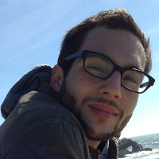
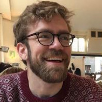
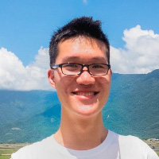
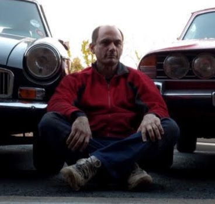

Wordbank is an open database of children's vocabulary growth, built on data
from the MacArthur-Bates Communicative Development Inventories (CDIs) and
their adaptations across many languages. It is developed and maintained by
the [Language and Cognition Lab](https://langcog.stanford.edu) at Stanford
University.

::: {.panel-tabset}

## Project Contributors

::: {.team-grid}
[**Michael C. Frank**<br>Stanford University](http://web.stanford.edu/~mcfrank)

[**Virginia Marchman**<br>Stanford University](https://web.stanford.edu/group/langlearninglab/cgi-bin/research-associates/Virginia_Marchman,_Ph.D.php)

[**Mika Braginsky**<br>Stanford University](http://mikabr.github.io)

[**Daniel Yurovsky**<br>Carnegie Mellon University](https://www.danyurovsky.com/)

**Danielle Kellier**<br>UPenn

[**Benny deMayo**<br>Princeton University](https://hudl.princeton.edu/people/benjamin-demayo)

[**George Kachergis**<br>Skillprint](http://www.kachergis.com/)

**Alvin Tan**<br>Stanford University

[**Jess Mankewitz**<br>UW-Madison](https://jmankewitz.com/)

**Henry Mehta**<br>Hexia Web Services Limited
:::

### Who funds Wordbank?

The team would like to thank our supporters! The construction of Wordbank was
funded by a grant from the National Science Foundation (#1451577), as well as
generous support from the MB-CDI Advisory Board.

Thanks to [Brock Ferguson](http://www.brockferguson.com/) for help with
database design and optimization, and to Rose Schneider for logo design.

## Papers and Publications

Publications are rendered from
[resources/publications.json](https://github.com/langcog/wordbank-datapage/blob/main/resources/publications.json)
— edit that file to add a paper.

```{ojs pubs-setup}
//| output: false
d3 = require("d3@7")
pubs = d3.json("resources/publications.json")
```

```{ojs pubs-table}
html`<table class="pubs-table">
  <thead><tr><th>Year</th><th>Citation</th><th></th></tr></thead>
  <tbody>${pubs.map((p) => html`<tr>
    <td>${p.year}</td>
    <td>${p.authors} (${p.year}). ${p.title}. <em>${p.venue}.</em></td>
    <td>${p.link ? html`<a href="${p.link}" target="_blank">[${p.link_label ?? "pdf"}]</a>` : ""}</td>
  </tr>`)}</tbody>
</table>`
```

:::

## Links

- [Contact us](mailto:wordbank-contact@stanford.edu)
- [Wordbank on GitHub](https://github.com/langcog/wordbank-datapage)
- [wordbankr tutorial](http://langcog.github.io/wordbankr)
- [wordbankr on GitHub](https://github.com/langcog/wordbankr)

## This site

This site is a static rebuild of the original wordbank.stanford.edu: data are
hosted on [Redivis](https://redivis.com/datapages/datasets/wordbank) and all
visualization runs in your browser. Source at
[langcog/wordbank-datapage](https://github.com/langcog/wordbank-datapage).
