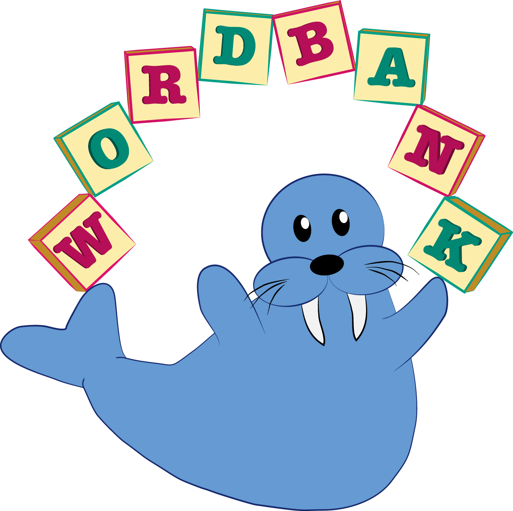
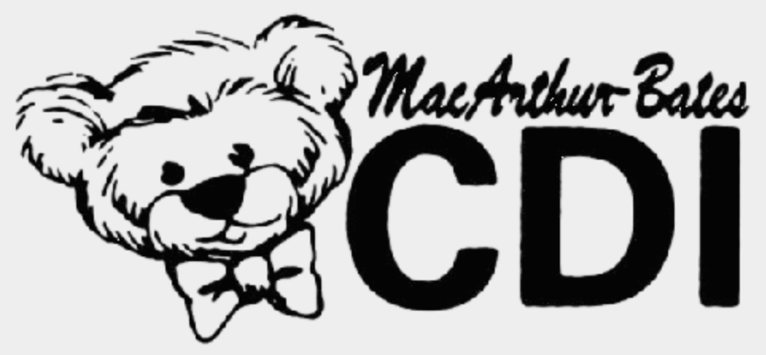
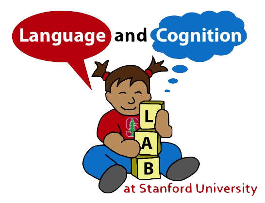
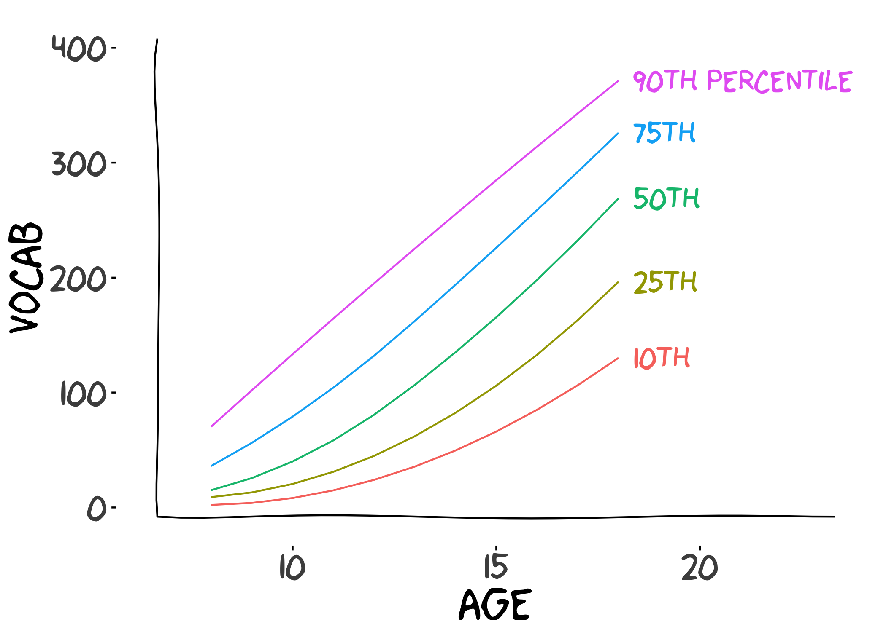
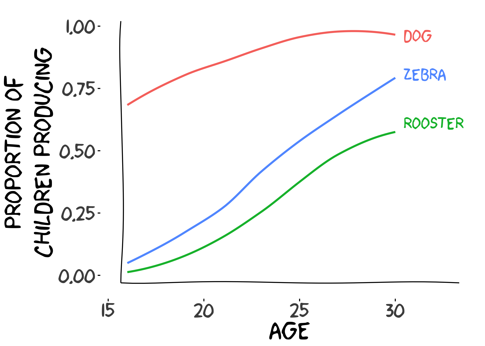

```{=html}
<div class="wb-hero">
  
  <div class="wb-hero-title">
    <div class="wb-title">Wordbank</div>
    <p>An open database of children's vocabulary development</p>
  </div>
  <div class="wb-hero-logos">
    <a href="https://mb-cdi.stanford.edu/"></a>
    <a href="https://langcog.stanford.edu/"></a>
  </div>
</div>
```



:::: {.grid}

::: {.g-col-12 .g-col-md-6}

<br>

```{=html}
<div class="analysis-thumbs">
  <a href="norms.html">
    
    <h4>Vocabulary Norms</h4>
    <p>Explore vocabulary size growth curves for various languages and demographic groups.</p>
  </a>
  <a href="trajectories.html">
    
    <h4>Item Trajectories</h4>
    <p>Explore trajectories of individual words across languages and ages.</p>
  </a>
</div>
```

More: [Cross-Linguistic Trajectories](crossling.html) ·
[CDI Scoring](scoring.html) · [Data](data.html)

:::

::: {.g-col-12 .g-col-md-6 .text-center}

```{ojs lang-lead}
html`<div class="lang-lead">Wordbank contains data from ${stats.n_children.toLocaleString()} children<br>
and ${stats.n_administrations.toLocaleString()} CDI administrations, across<br>
${stats.n_languages} languages and ${stats.n_instruments} instruments:</div>`
```

```{ojs bubble-setup}
//| output: false
d3 = require("d3@7")
langs = transpose(lang_stats)
```

```{ojs language-bubbles}
// the language bubble pack from the original wordbank home page:
// one bubble per language, area ~ n_children^0.65, HCL rainbow by size rank
{
  const width = 450, height = 425;

  const root = d3.pack()
    .size([width, height])
    .padding(5)(
      d3.hierarchy({ children: langs })
        .sum((d) => Math.pow(d.count, 0.65))
        .sort((a, b) => b.value - a.value)
    );

  const color = new Map(langs.map((d, i) =>
    [d.name, d3.hcl((i * 360 / langs.length) % 360, 60, 60).formatHex()]));

  const svg = d3.create("svg")
    .attr("viewBox", [0, 0, width, height])
    .attr("style", "max-width: 450px; width: 100%; height: auto; display: inline-block;");

  const node = svg.selectAll("g")
    .data(root.leaves())
    .join("g")
    .attr("transform", (d) => `translate(${d.x},${d.y})`);

  node.append("circle")
    .attr("r", (d) => d.r)
    .attr("fill", (d) => color.get(d.data.name));

  node.append("title")
    .text((d) => `${d.data.language}: ${d.data.count.toLocaleString()} children`);

  const ctx = document.createElement("canvas").getContext("2d");
  ctx.font = "12px sans-serif";
  const fontSize = (d) => {
    const w = ctx.measureText(d.data.name).width;
    return Math.max(0, Math.min(2 * d.r, (2 * d.r - 6) / w * 12));
  };

  node.append("text")
    .attr("dy", ".35em")
    .attr("text-anchor", "middle")
    .attr("fill", "white")
    .attr("style", "font-family: var(--sans-serif); pointer-events: none;")
    .style("font-size", (d) => fontSize(d) + "px")
    .text((d) => d.data.name);

  return svg.node();
}
```

:::

::::

---

Wordbank archives data from the [MacArthur-Bates Communicative Development
Inventories](https://mb-cdi.stanford.edu/) (CDIs), parent-report instruments
that measure early language development. Data are contributed by researchers
around the world and are freely available for browsing, visualization, and
download.

If you use Wordbank, please cite: Frank, M. C., Braginsky, M., Yurovsky, D.,
& Marchman, V. A. (2017). Wordbank: An open repository for developmental
vocabulary data. *Journal of Child Language, 44*(3), 677–694.
