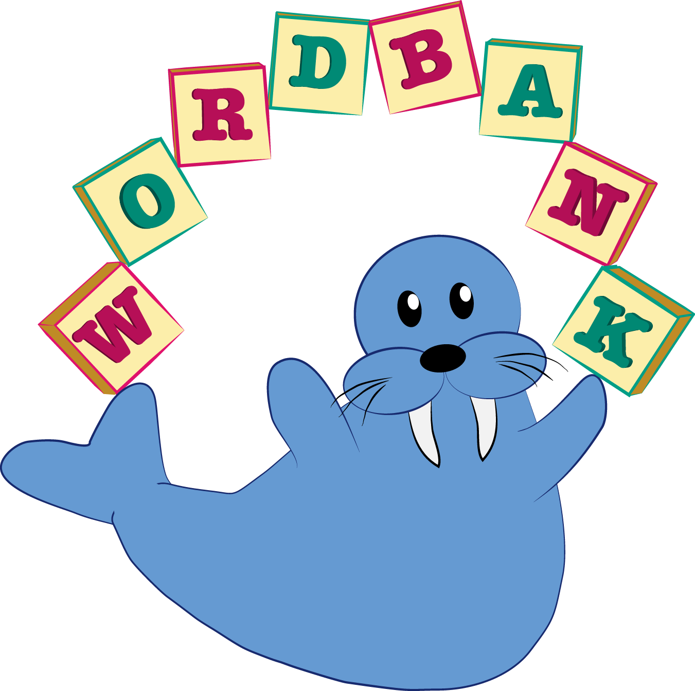
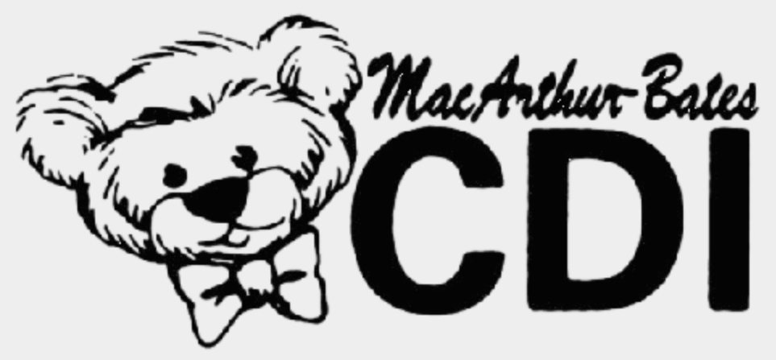
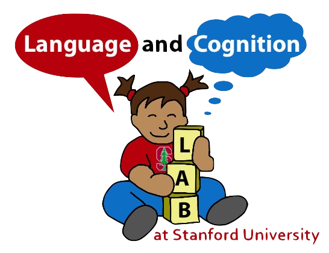
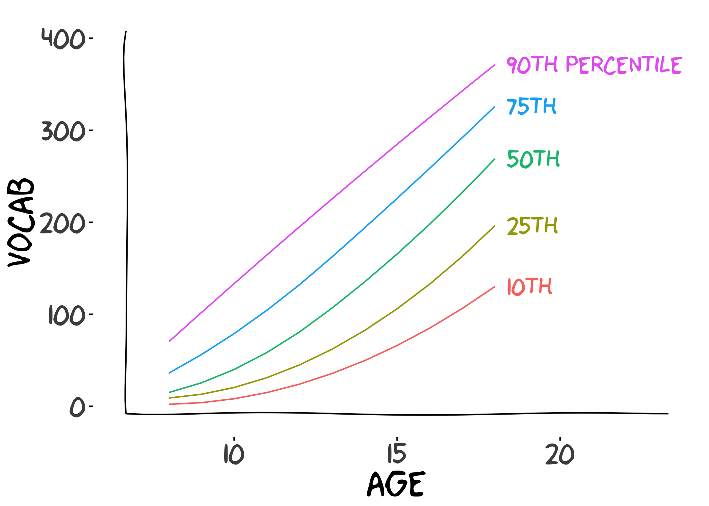
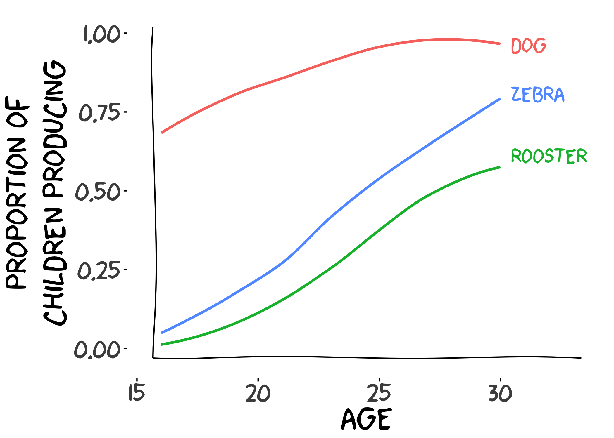

```{=html}
<div class="wb-hero">
  
  <div class="wb-hero-title">
    <div class="wb-title" role="heading" aria-level="1">Wordbank</div>
    <p>An open database of children's vocabulary development</p>
  </div>
  <div class="wb-hero-logos">
    <a href="https://mb-cdi.stanford.edu/"></a>
    <a href="https://langcog.stanford.edu/"></a>
  </div>
</div>
```



:::: {.grid}

::: {.g-col-12 .g-col-md-6 .text-center}

```{ojs lang-lead}
html`<div class="lang-lead">Wordbank contains data from ${stats.n_children.toLocaleString()} children<br>
and ${stats.n_administrations.toLocaleString()} CDI administrations, across<br>
${stats.n_languages} languages and ${stats.n_instruments} instruments.</div>`
```

```{=html}
<div class="analysis-thumbs" style="margin-top: 1rem">
  <a href="norms.html">
    
    <span class="thumb-title">Vocabulary Norms</span>
    <p>Explore vocabulary size growth curves for various languages and demographic groups.</p>
  </a>
  <a href="trajectories.html">
    
    <span class="thumb-title">Item Trajectories</span>
    <p>Explore trajectories of individual words across languages and ages.</p>
  </a>
</div>
<p style="margin-top: 0.75rem">Also explore <a href="crossling.html">Cross-Linguistic Trajectories</a>,
<a href="scoring.html">CDI Scoring</a>, and the full <a href="data.html">Data</a>.</p>
```

:::

::: {.g-col-12 .g-col-md-6 .text-center}

```{ojs bubble-setup}
//| output: false
d3 = require("d3@7")
// D3 v3, for layout.pack — the original site's snail layout (v3's UMD
// wrapper doesn't resolve through require(), so load it directly)
d3v3 = {
  const src = await (await fetch("https://cdn.jsdelivr.net/npm/d3@3.5.17/d3.min.js")).text();
  const prev = window.d3;
  (new Function(src)).call(window);
  const v3 = window.d3;
  window.d3 = prev;
  return v3;
}
langs = transpose(lang_stats)
```

```{ojs language-bubbles}
// the language "snail", laid out exactly as on the original site
// (templates/home.html): D3 v3 d3.layout.pack, descending sort,
// value = n_children^0.65, padding 5, HCL rainbow by rank
{
  const width = 450, height = 425;

  const root = { children: langs.map((d) => ({
    ...d, value: Math.pow(d.count, 0.65) })) };
  const bubble = d3v3.layout.pack()
    .sort((a, b) => b.value - a.value)
    .size([width, height])
    .padding(5);
  const placed = bubble.nodes(root).filter((d) => !d.children);

  const sorted = [...placed].sort((a, b) => b.value - a.value);
  const color = new Map(sorted.map((d, i) =>
    [d.name, d3.hcl((i * 360 / sorted.length) % 360, 60, 60).formatHex()]));

  const svg = d3.create("svg")
    .attr("viewBox", [0, 0, width, height])
    .attr("style", "max-width: 450px; width: 100%; height: auto; display: inline-block;");

  const node = svg.selectAll("g")
    .data(placed)
    .join("g")
    .attr("transform", (d) => `translate(${d.x},${d.y})`);

  node.append("circle")
    .attr("r", (d) => d.r)
    .attr("fill", (d) => color.get(d.name));

  node.append("title")
    .text((d) => `${d.language}: ${d.count.toLocaleString()} children`);

  const ctx = document.createElement("canvas").getContext("2d");
  ctx.font = "12px sans-serif";
  const fontSize = (d) => {
    const w = ctx.measureText(d.name).width;
    return Math.max(0, Math.min(2 * d.r, (2 * d.r - 6) / w * 12));
  };

  node.append("text")
    .attr("dy", ".35em")
    .attr("text-anchor", "middle")
    .attr("fill", "white")
    .attr("style", "font-family: var(--sans-serif); pointer-events: none;")
    .style("font-size", (d) => fontSize(d) + "px")
    .text((d) => d.name);

  return svg.node();
}
```

:::

::::

Wordbank archives data from the [MacArthur-Bates Communicative Development
Inventories](https://mb-cdi.stanford.edu/) (CDIs), parent-report instruments
that measure early language development. Data are contributed by researchers
around the world and are freely available for browsing, visualization, and
download.

If you use Wordbank, please cite: Frank, M. C., Braginsky, M., Yurovsky, D.,
& Marchman, V. A. (2017). Wordbank: An open repository for developmental
vocabulary data. *Journal of Child Language, 44*(3), 677–694.
[doi:10.1017/S0305000916000209](https://doi.org/10.1017/S0305000916000209)

For in-depth analysis and synthesis, please see the
[Wordbank book](http://wordbank-book.stanford.edu) (Frank et al., 2021, MIT
Press).
